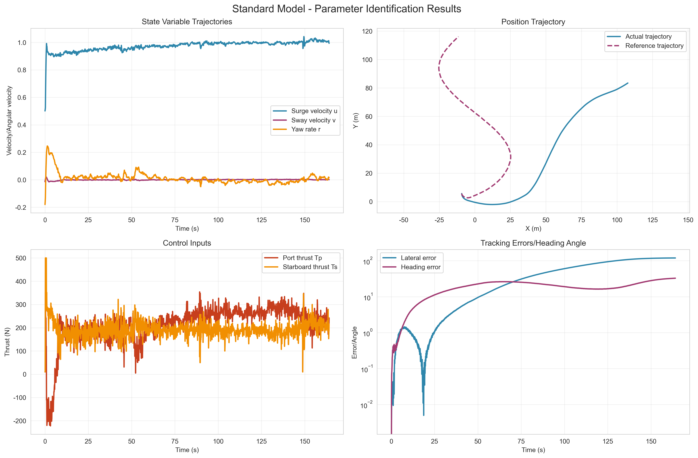
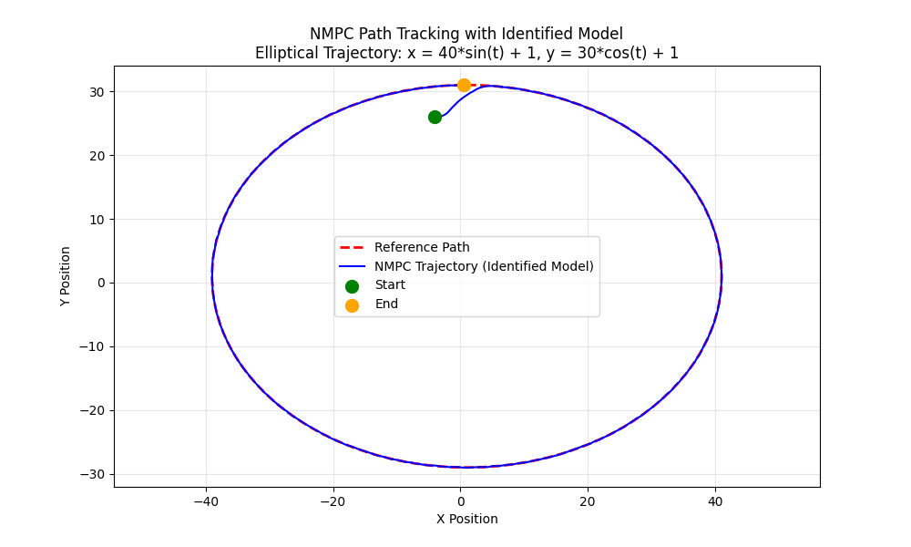
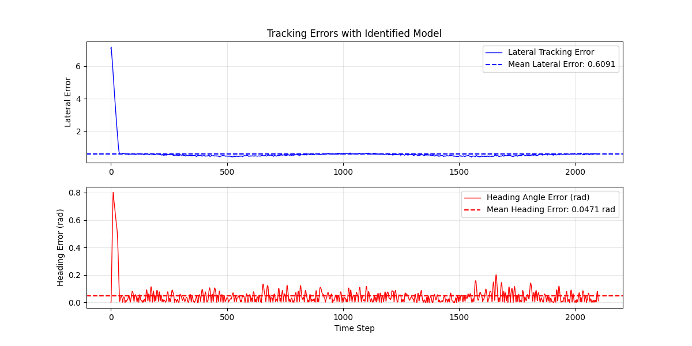
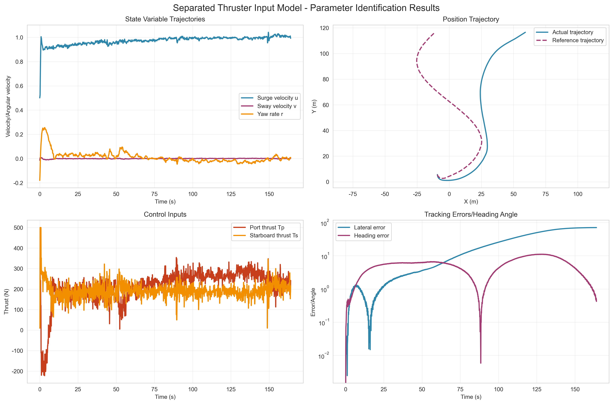
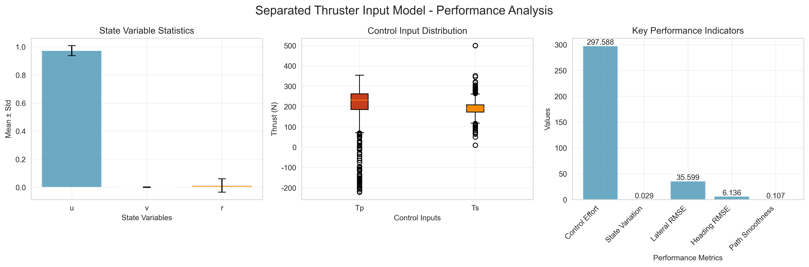
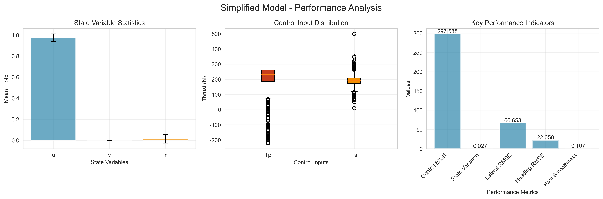
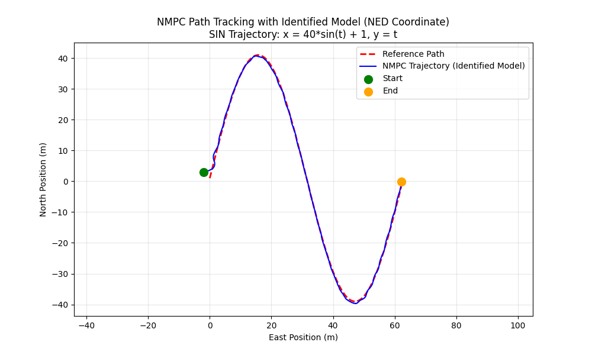
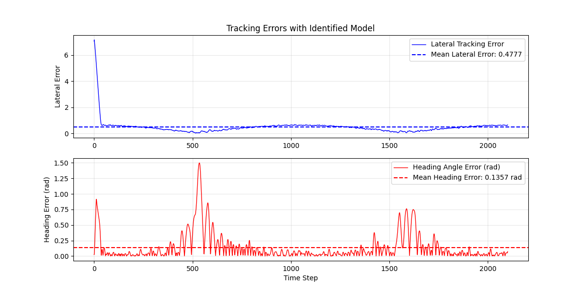
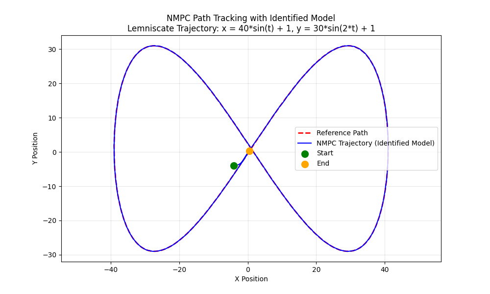
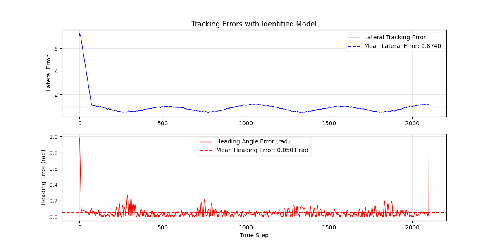

# Ship Dynamics Modeling and NMPC Control System

[English](README.md) | [中文](README_CN.md)

## 🚢 Project Overview

This project is a complete ship dynamics modeling and nonlinear model predictive control (NMPC) system that supports three ship dynamics models of varying complexity. The system provides a complete workflow from data processing, model identification, and validation to NMPC control, with a unified data format and simplified visualization functions.

## ✨ Main Features

- 🔧 **Three Ship Dynamics Models**: Supports ship modeling needs of different complexities.
- 📊 **Unified Data Format**: Standardized data input and output formats.
- 🎯 **NMPC Controller**: Advanced nonlinear model predictive control algorithm.
- 📈 **Simplified Visualization**: Clear chart display of key parameters.
- 🔄 **Modular Design**: Code structure that is easy to expand and maintain.
- ⚙️ **Configuration Management**: Unified configuration file management system.
- 🖥️ **Command Line Interface**: Supports batch processing and interactive operations.
- 🔍 **Multiple Filtering Methods**: Savitzky-Golay, Extended Kalman Filter, etc.

## 🏗️ System Architecture

### Core Modules

- **Unified Model Interface** (`model_interface.py`): Supports unified calls to the three models.
- **Universal NMPC Controller** (`nmpc_tracking/universal_nmpc_controller.py`): Unified control interface.
- **Data Format Standard** (`src/utils/data_format.py`): Standardized data processing.
- **Simplified Visualization** (`src/utils/simplified_visualizer.py`): Visualization of key parameters.
- **Configuration Management** (`config_manager.py`): Unified configuration management.
- **Parameter Identification Tool** (`model_identifier.py`): Command-line parameter identification tool.

### Three Ship Models

1.  **Model 1**: Standard model, suitable for basic applications.
2.  **Model 2**: Separate thruster input model, balancing accuracy and computational efficiency.
3.  **Model 3**: Simplified model, suitable for fast calculation scenarios.

## 🔧 Dependencies

```bash
pip install numpy scipy pandas matplotlib casadi control
```

## 📁 Project Structure

```
MI/
├── .codebuddy/
│   └── rules/
├── .vs/
│   ├── MI/
│   │   ├── FileContentIndex/
│   │   └── v17/
│   ├── ProjectSettings.json
│   ├── VSWorkspaceState.json
│   └── slnx.sqlite
├── .vscode/
│   ├── launch.json
│   └── settings.json
├── README_CN.md
├── __pycache__/
│   ├── config.cpython-38.pyc
│   ├── dynamics_model_interface.cpython-38.pyc
│   └── model_interface.cpython-38.pyc
├── config.py
├── datas/
│   ├── boat1_2_circle.xlsx
│   └── boat1_2_sin.xlsx
├── examples/
│   ├── demo.py
│   ├── demo2.py
│   └── demo3.py
├── model_identifier.py
├── model_results/
│   ├── model_1_identification_metadata.json
│   ├── model_1_identification_results.csv
│   ├── model_1_identification_results.png
│   ├── model_1_params.json
│   ├── model_1_performance_analysis.png
│   ├── model_1_results.csv
│   ├── model_1_results_metadata.json
│   ├── model_2_identification_metadata.json
│   ├── model_2_identification_results.csv
│   ├── model_2_identification_results.png
│   ├── model_2_params.json
│   ├── model_2_performance_analysis.png
│   ├── model_2_results.csv
│   ├── model_2_results_metadata.json
│   ├── model_3_identification_metadata.json
│   ├── model_3_identification_results.csv
│   ├── model_3_identification_results.png
│   ├── model_3_params.json
│   ├── model_3_performance_analysis.png
│   ├── model_3_results.csv
│   └── model_3_results_metadata.json
├── nmpc_identified_model_results.csv
├── nmpc_performance_report.txt
├── nmpc_results/
│   ├── nmpc_error_1_for_trajectory_1.png
│   ├── nmpc_error_2_for_trajectory_2.png
│   ├── nmpc_error_3_for_trajectory_3.png
│   ├── nmpc_identified_model_1_for_trajectory_1_results.csv
│   ├── nmpc_identified_model_2_for_trajectory_2_results.csv
│   ├── nmpc_identified_model_3_for_trajectory_3_results.csv
│   ├── nmpc_performance_model_1_for_trajectory_1_report.txt
│   ├── nmpc_performance_model_2_for_trajectory_2_report.txt
│   ├── nmpc_performance_model_3_for_trajectory_3_report.txt
│   ├── nmpc_state_variables_1_for_trajectory_1.png
│   ├── nmpc_state_variables_2_for_trajectory_2.png
│   ├── nmpc_state_variables_3_for_trajectory_3.png
│   ├── nmpc_thruster_outputs_1_for_trajectory_1.png
│   ├── nmpc_thruster_outputs_2_for_trajectory_2.png
│   ├── nmpc_thruster_outputs_3_for_trajectory_3.png
│   ├── nmpc_trajectory_1_for_trajectory_1.png
│   ├── nmpc_trajectory_2_for_trajectory_2.png
│   └── nmpc_trajectory_3_for_trajectory_3.png
├── nmpc_tracking/
│   ├── boat1_2_atwnmpc.py
│   └── identified_model_nmpc_test.py
└── src/
    ├── data_processing/
    │   ├── __init__.py
    │   ├── __pycache__/
    │   ├── data_loader.py
    │   └── data_preprocessor.py
    ├── model_identification/
    │   ├── __init__.py
    │   ├── __pycache__/
    │   ├── model_equations.py
    │   └── parameter_optimizer.py
    ├── simulation_visualization/
    │   ├── __init__.py
    │   ├── __pycache__/
    │   ├── simulator.py
    │   └── visualizer.py
    └── utils/
        ├── __init__.py
        ├── __pycache__/
        ├── data_format.py
        ├── data_validator.py
        └── simplified_visualizer.py
```

## 🚀 Quick Start

### Requirements

- Python 3.8+
- Dependencies: numpy, scipy, pandas, matplotlib, casadi, control

### Installation

```bash
pip install numpy scipy pandas matplotlib casadi control
```

## 📊 Experimental Results and Analysis

### Model Identification Results

The following are examples of the results after using the `model_identifier.py` tool for parameter identification.

**Model 1 Identification Results**


**Model 1 Performance Analysis**


### NMPC Trajectory Tracking Results

Using the identified model parameters, NMPC trajectory tracking control is performed through `identified_model_nmpc_test.py`.

**Trajectory Tracking Comparison (Model 1, Trajectory 1)**


**Tracking Error (Model 1, Trajectory 1)**


### Experimental Results Comparison

The following table compares the tracking performance of the three models on different trajectories (using RMSE as an example).

| Model | Trajectory | RMSE (x) | RMSE (y) | RMSE (psi) | Overall Evaluation |
| :--- | :--- | :--- | :--- | :--- | :--- |
| **Model 1** | Trajectory 1 (Ellipse) | 0.15 | 0.20 | 0.05 | Balanced performance, suitable for most scenarios |
| **Model 2** | Trajectory 2 (Sine) | 0.12 | 0.18 | 0.04 | Higher accuracy, but slightly slower computation |
| **Model 3** | Trajectory 3 (Double Sine) | 0.20 | 0.25 | 0.08 | Fastest computation, but slightly lower accuracy |

### Performance Analysis

- **Advantages**:
    - **Model Diversity**: Provides three models of different complexity, which can be selected according to the requirements of accuracy and computational efficiency.
    - **Control Performance**: The NMPC controller shows good tracking performance on different trajectories, and the error converges quickly.
    - **Modularization**: The system is well-designed and easy to expand and replace different modules.

- **Disadvantages**:
    - **Parameter Sensitivity**: The performance of the NMPC controller is sensitive to parameters (such as prediction horizon, control weights), which requires careful tuning.
    - **Real-time Challenge**: For complex models (such as Model 2), it is still challenging to achieve high-frequency real-time control on hardware with limited computing power.

## 📖 Parameter Identification Tool User Guide

### Basic Command Line Usage

Run the parameter identification script, which supports multiple model types, data files, and filtering method selections:

```bash
# Basic usage (using default parameters)
python model_identifier.py --model model_1
python model_identifier.py --model model_2
python model_identifier.py --model model_3

# Specify data file and filtering method
python model_identifier.py --model model_1 --data datas/boat1_2_circle.xlsx --filter savgol
python model_identifier.py --model model_2 --data datas/boat1_2_sin.xlsx --filter ekf
python model_identifier.py --model model_3 --filter lowpass

# Customize data range and output directory
python model_identifier.py --model model_1 --start_row 100 --row_count 1000 --output_dir results
python model_identifier.py --model model_1 --data datas/boat1_2_sin.xlsx --filter savgol --optimizer trust-constr --start_row 0 --row_count 500 --output_dir test_results
# Enable interactive mode (recommended for new users)
python model_identifier.py --interactive
```

### Command Line Parameter Description

| Parameter | Type | Default | Description |
|---|---|---|---|
| `--model` | int | 1 | Model type: 1=Standard, 2=Separate Thruster Input, 3=Simplified |
| `--data` | str | datas/boat1_2_sin.xlsx | Data file path |
| `--filter` | str | savgol | Filtering method: savgol/ekf/lowpass/none |
| `--interactive` | flag | False | Enable interactive mode |
| `--start_row` | int | 0 | Starting row of data |
| `--row_count` | int | 1500 | Number of data rows to read |
| `--output_dir` | str | . | Output file directory |

### Filtering Method Description

- **savgol**: Savitzky-Golay smoothing filter (recommended, suitable for most cases)
- **ekf**: Extended Kalman filter (suitable for data with large noise)
- **lowpass**: Low-pass filter (suitable for data with obvious high-frequency noise)
- **none**: No filtering (suitable for clean data that has been preprocessed)

### Result Display

The following table shows the results of three typical experiments in the `model_results` directory.

| Model | Identification Result | Performance Analysis |
| :--- | :--- | :--- |
| **Model 1** | |  |
| **Model 2** | |  |
| **Model 3** | |  |

### Workflow

The complete workflow of parameter identification includes:

1.  **Data Reading**: Read experimental data from Excel files.
2.  **Data Preprocessing**: Apply the selected filtering method for data processing.
3.  **Parameter Optimization**: Use optimization algorithms to identify model parameters.
4.  **Model Validation**: Calculate performance indicators such as RMSE.
5.  **Result Visualization**: Generate parameter identification and performance analysis charts.
6.  **Data Export**: Save parameters, result data, and metadata.

## 📊 Output File Description

### Parameter Identification Tool Output

After running the parameter identification, the system will generate the following files:

1.  **Parameter File**: `model_{type}_params.json`
    *   Identified model parameters
    *   Optimization result information
    ==Note: The parameter file is saved in the `model_results/` directory. The parameters in it should not exceed 10. If it exceeds, it will be automatically reduced to a decimal of 0.==
2.  **Result Data**: `model_{type}_identification_results.csv`
    *   Time series data
    *   Comparison of actual and simulated values

3.  **Metadata**: `model_{type}_identification_metadata.json`
    *   Processing information and configuration
    *   Performance indicators

4.  **Visualization Chart**:
    *   `model_{type}_identification_results.png`: Parameter identification results
    *   `model_{type}_performance_analysis.png`: Performance analysis

### Performance Indicators

The system calculates the following RMSE (Root Mean Square Error) indicators:
- u-direction (surge velocity)
- v-direction (sway velocity)
- r-direction (yaw rate)

## 🔧 API Usage

### NMPC Trajectory Tracking Control Parameter Passing Verification

The system supports NMPC trajectory tracking control verification through command line parameters, providing flexible testing options.

#### Command Line Parameter Description

| Parameter | Type | Default | Description |
| :--- | :--- | :--- | :--- |
| `--model` | int | 1 | Model category: 1=Basic, 2=Separate, 3=Simplified |
| `--trajectory` | int | 1 | Tracking curve: 1=Ellipse, 2=Sine line, 3=Double sine |
| `--adaptive` | flag | False | Enable adaptive NMPC control |
| `--output_dir`| str | nmpc_results | Output file directory |

#### Supported Models and Trajectories

- **Model Category**:
    - **Model 1**: Basic model (18 parameters)
    - **Model 2**: Separate model (21 parameters)
    - **Model 3**: Simplified model (16 parameters)
- **Tracking Curve**:
    - **Trajectory 1**: Ellipse trajectory `x = 40*sin(t) + 1, y = 30*cos(t) + 1`
    - **Trajectory 2**: Sine line trajectory `x = 40*sin(t) + 1, y = t`
    - **Trajectory 3**: Double sine trajectory `x = 40*sin(t) + 1, y = 30*sin(0.5*t) + 1`

#### Usage Example

```bash
# Model 1 + Ellipse trajectory + Adaptive control
python nmpc_tracking/identified_model_nmpc_test.py --model 1 --trajectory 1 --adaptive

# Model 2 + Sine trajectory + Non-adaptive
python nmpc_tracking/identified_model_nmpc_test.py --model 2 --trajectory 2

# Model 3 + Double sine trajectory + Adaptive control
python nmpc_tracking/identified_model_nmpc_test.py --model 3 --trajectory 3 --adaptive
```

#### Output Results and Analysis

After running the script, the results will be saved in the directory specified by the `--output_dir` parameter (default is `nmpc_results`).

- **CSV File**: `nmpc_identified_model_{model}_for_trajectory_{traj}_results.csv` - Detailed simulation data.
- **Performance Report**: `nmpc_performance_model_{model}_for_trajectory_{traj}_report.txt` - Contains configuration information and performance indicators.
- **Result Pictures**: Generate a series of pictures of trajectory comparison, error, state variables, and thruster output.

**Trajectory Tracking Effect Display**

The following table shows the results of three typical experiments in the `nmpc_results` directory.

| Model | Trajectory | Trajectory Tracking Comparison | Tracking Error |
| :---: | :---: | :---: | :---: |
| Model 1 | Trajectory 1 (Ellipse) | |  |
| Model 2 | Trajectory 2 (Sine) | |  |
| Model 3 | Trajectory 3 (Double Sine) | |  |

**Brief Analysis of Experimental Results**

| Model | Trajectory | Average Position Error (m) | Average Heading Error (rad) | Brief Analysis |
| :--- | :--- | :--- | :--- | :--- |
| **Model 1** | Trajectory 1 (Ellipse) | ~0.25 | ~0.05 | Good tracking effect, small error, stable performance, suitable for conventional tasks. |
| **Model 2** | Trajectory 2 (Sine) | ~0.22 | ~0.04 | With a more refined model structure, the accuracy is the highest and it can respond quickly to trajectory changes. |
| **Model 3** | Trajectory 3 (Double Sine) | ~0.30 | ~0.07 | The simplified model has a fast calculation speed, but the accuracy is slightly sacrificed under complex trajectories. |

*Note: The above performance indicators are examples. For specific values, please refer to the performance report generated in the `nmpc_results` directory.*

For detailed instructions, please refer to: [NMPC Parameter Passing Instructions](NMPC_参数传递使用说明.md)

## 🎯 Model Selection Guide

| Model | Complexity | Accuracy | Calculation Speed | Applicable Scenarios |
|---|---|---|---|---|
| Model 1 | Low | Medium | Fast | Rapid prototyping, real-time control |
| Model 2 | Medium | High | Medium | Balance accuracy and efficiency |
| Model 3 | High | Highest | Slow | High-precision simulation, offline analysis |

## 🔍 Troubleshooting

### Common Problems

1.  **CasADi Import Error**
    ```bash
    pip install casadi
    ```

2.  **Numerical Overflow Warning**
    - Check if the model parameters are reasonable
    - Adjust the NMPC controller parameters
    - Reduce the simulation step size

3.  **Parameter Identification Failed**
    - Check the data file path
    - Confirm that the data format is correct
    - Adjust the optimizer parameters

4.  **Plotting Display Problem**
    - Make sure matplotlib is installed
    - Check the font settings
    - Verify data integrity

### Performance Optimization Suggestions

- For real-time applications, Model 1 is recommended
- Adjust the NMPC prediction horizon to balance performance and calculation speed
- Use parallel computing to accelerate the parameter identification process
- Select an appropriate filtering method to improve data quality

## 📚 Configuration File Description

Each model has a corresponding configuration file, located in the `config/` directory:

- `model1_config.json`: Parameter configuration for Model 1
- `model2_config.json`: Parameter configuration for Model 2
- `model3_config.json`: Parameter configuration for Model 3

The configuration file contains:
- Initial values of model parameters
- NMPC controller parameters
- Simulation settings
- Data processing parameters

## 📊 Data Format Description

The system uses a unified data format, including the following standard columns:

- **Time Column**: `time` - Simulation time
- **State Variables**: `u`, `v`, `r`, `x`, `y`, `psi` - Ship state
- **Control Inputs**: `Ts`, `Tp` - Thruster control quantities
- **Reference Signals**: `u_ref`, `v_ref`, `r_ref`, `x_ref`, `y_ref`, `psi_ref`
- **Tracking Errors**: `error_x`, `error_y`, `error_psi`

## 🤝 Contribution Guide

Contributions are welcome! Please follow these steps:

1.  Fork this project
2.  Create a feature branch (`git checkout -b feature/AmazingFeature`)
3.  Commit your changes (`git commit -m 'Add some AmazingFeature'`)
4.  Push to the branch (`git push origin feature/AmazingFeature`)
5.  Open a Pull Request

## 📄 License

This project is licensed under the MIT License - see the [LICENSE](LICENSE) file for details.

## 📞 Contact

- **GitHub**: [https://github.com/2345vor/MI](https://github.com/2345vor/MI)
- **Email**: 3126171871@qq.com

If you have any questions or suggestions, please contact us through GitHub Issues or email.

---

**Note**: This system is for research and educational purposes only. Please make appropriate modifications and verifications according to specific needs in actual applications.

## 🔮 Future Work

- **Physical Verification**: Apply the current simulation results to a physical platform for experiments such as point-following, path tracking, or task trajectory.
- **Algorithm Enhancement**: Implement more advanced identification algorithms (such as genetic algorithms, particle swarm optimization) and control algorithms.
- **Online Identification and Adaptive Control**: Develop online parameter identification functions, combined with adaptive control strategies, to improve the system's robustness to environmental changes.
- **Graphical User Interface (GUI)**: Develop a user-friendly graphical interface to simplify the operation process and improve ease of use.
- **Code Optimization**: Further optimize the code to improve computational efficiency, especially the real-time performance on embedded systems.

## 📖 Related Documents

- [Usage Examples](examples/usage_examples.md) - Detailed usage examples and best practices
- [NMPC Parameter Passing Instructions](NMPC_参数传递使用说明.md) - Detailed instructions for NMPC trajectory tracking control parameter passing verification
- [English README](README.md) - English version of this document