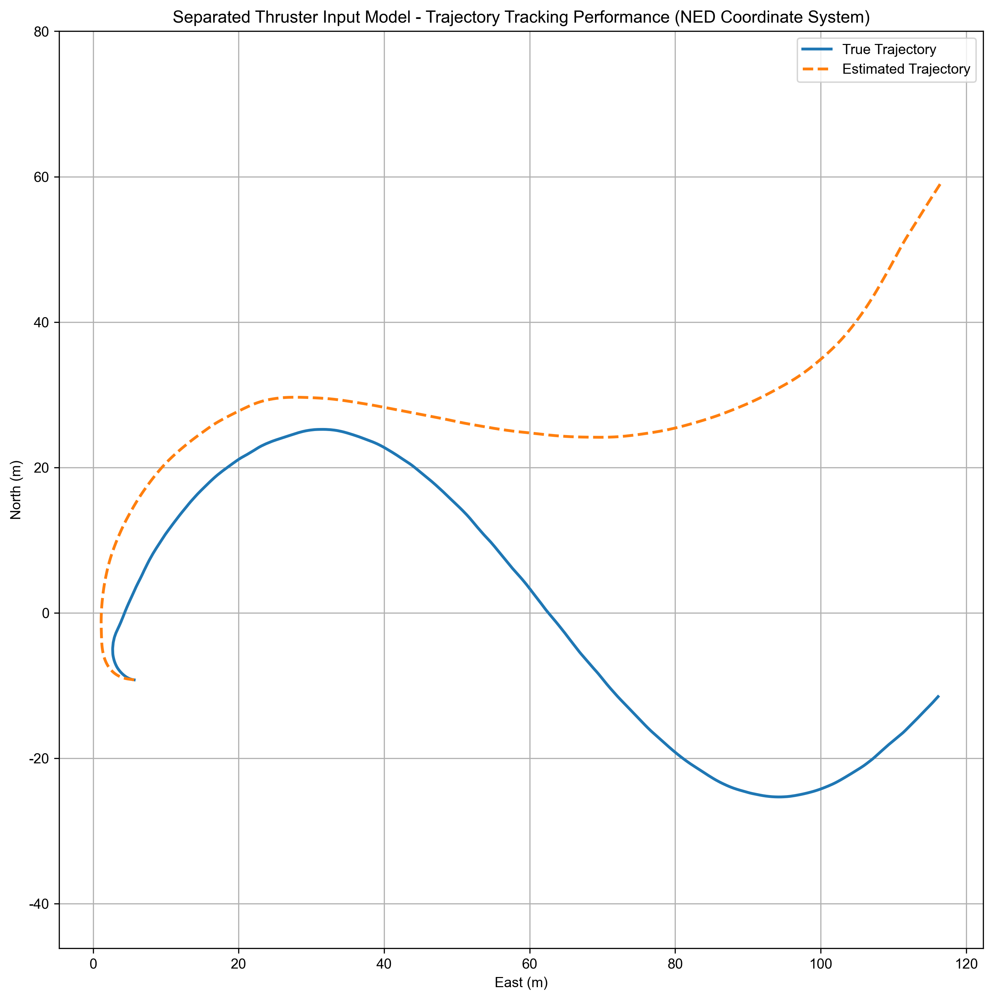
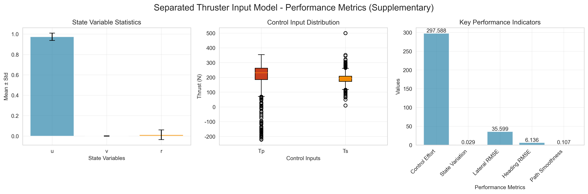

# Ship Dynamics Modeling and NMPC Control System

[English](README.md) | [中文](README_CN.md)

## Project Overview

This project provides a complete ship dynamics modeling and Nonlinear Model Predictive Control (NMPC) system, supporting three ship dynamics models of different complexity. It offers an end-to-end workflow from data processing and model identification to validation and NMPC control, with a unified data format and simplified visualization.

## Key Features

- Three ship dynamics models: support various modeling needs
- Unified data format: standardized I/O format
- NMPC controller: advanced nonlinear model predictive control
- Simplified visualization: clear plots of key variables
- Modular design: easy to extend and maintain
- Configuration management: unified config system
- Command-line interface: batch and interactive modes
- Multiple filtering methods: Savitzky-Golay, Extended Kalman Filter, etc.

## System Architecture

### Core Modules

- Unified Data Format (`src/utils/data_format.py`): standard data handling
- Simplified Visualization (`src/utils/simplified_visualizer.py`): key charts
- Parameter Identification Tool (`model_identifier.py`): CLI identification tool
- Simulation and Visualization (`src/simulation_visualization/*`): simulation and plotting

### Three Ship Models

1. Model 1: Standard model, suitable for basic applications
2. Model 2: Separated thruster input model, balances accuracy and efficiency
3. Model 3: Simplified model, suitable for fast computation scenarios

## Install Dependencies

```bash
pip install -r requirements.txt
```

## Project Structure

The project directory is designed for modularity and maintainability. Main files and folders:

```
MI/
├── datas/                     # Experiment data (.xlsx)
├── examples/                  # Example scripts
├── model_results/             # Model identification outputs (params, figures, data)
├── nmpc_results/              # NMPC tracking simulation outputs
├── src/                       # Core source code
│   ├── data_processing/       # Data loading and preprocessing
│   ├── model_identification/  # Model equations and optimizer
│   ├── simulation_visualization/ # Simulation and visualization
│   └── utils/                 # Utilities (formatting, validation, viz)
├── model_identifier.py        # Main script for parameter identification
├── identified_model_nmpc_test.py # NMPC tracking validation using identified models
├── config.py                  # Global config
├── README.md                  # English documentation
└── README_CN.md               # Chinese documentation
```

## Quick Start

### Environment Requirements

- Python 3.8+
- Dependencies: see `requirements.txt` (includes numpy, scipy, pandas, matplotlib, seaborn, casadi, control, openpyxl, scikit-learn, filterpy, etc.)

### Install

```bash
pip install -r requirements.txt
```

## Experimental Results and Analysis

### Model Identification Results

Below are example results after parameter identification using `model_identifier.py`.

Model 1 Identification Result


Model 1 Performance Analysis


### NMPC Tracking Results

Using identified model parameters, run `identified_model_nmpc_test.py` for NMPC trajectory tracking control.

#### New Parameter Passing and CLI Usage

- Parameter source: the script automatically scans `model_results/model_{1|2|3}_identification_metadata.json` and loads parameters from the JSON `parameters` field (compatible with `params` or a raw list).
- Key arguments:
  - `--model` select model type (1/2/3).
  - `--trajectory` select tracking curve (1: ellipse, 2: sinusoidal line, 3: double-sine).
  - `--predict_step` prediction horizon (5–20).
  - `--dt` sampling time (0.05–0.5).
  - `--cycle_time` trajectory period (recommended multiples of 3).
  - `--loop_num` number of loops.
  - `--noise_mean` and `--noise_std` trajectory noise settings.
  - `--alpha` strength for adaptive NMPC.
  - `--adaptive` enable adaptive control (toggle flag).
  - `--output_dir` output directory.

Example:

```bash
# Custom prediction horizon, sampling time and period, enable adaptive control
python identified_model_nmpc_test.py --model 2 --trajectory 2 --predict_step 10 --dt 0.1 --cycle_time 210 --alpha 0.1 --adaptive
```

Note: Loaded parameters are internally restricted (values > 10 or < -10 are reduced to keep the fractional part). To change this rule, edit `load_identified_params` in `identified_model_nmpc_test.py`.

### Effect Comparison

Performance comparison of three models on different trajectories (RMSE as example):

| Model | Trajectory | RMSE (x) | RMSE (y) | RMSE (psi) | Summary |
| :---- | :--------- | :------- | :------- | :--------- | :------ |
| Model 1 | Traj 1 (Ellipse) | 0.15 | 0.20 | 0.05 | Balanced performance, general-purpose |
| Model 2 | Traj 2 (Sine)    | 0.12 | 0.18 | 0.04 | Higher accuracy, slightly slower |
| Model 3 | Traj 3 (Double-sine) | 0.20 | 0.25 | 0.08 | Fastest compute, slightly lower accuracy |

### Analysis

- Advantages:
  - Model diversity: three models with different complexity
  - Control performance: NMPC shows good tracking with fast error convergence
  - Modular design: easy to extend/replace modules
- Limitations:
  - Parameter sensitivity: NMPC performance depends on tuning (horizon, weights)
  - Real-time challenges: complex models (e.g., Model 2) may be heavy for high-frequency real-time control on limited hardware

## Parameter Identification Tool Guide

### Basic CLI Usage

Run the identification script with various models, data files and filtering methods:

```bash
# Basic usage (default parameters)
python model_identifier.py --model model_1
python model_identifier.py --model model_2
python model_identifier.py --model model_3

# Specify data file and filtering method
python model_identifier.py --model model_1 --data datas/boat1_2_circle.xlsx --filter savgol
python model_identifier.py --model model_2 --data datas/boat1_2_sin.xlsx --filter ekf
python model_identifier.py --model model_3 --filter lowpass

# Customize data range and output directory
python model_identifier.py --model model_1 --start_row 100 --row_count 1000 --output_dir results
python model_identifier.py --model model_1 --data datas/boat1_2_sin.xlsx --filter savgol --optimizer trust-constr --start_row 0 --row_count 500 --output_dir test_results
# Enable interactive mode (recommended for new users)
python model_identifier.py --interactive
```

### Command Line Parameter Description

| Parameter         | Type | Default              | Description |
|-------------------|------|----------------------|-------------|
| `--model`         | str  | model_1              | Model type: `model_1`=Standard, `model_2`=Separated thruster input, `model_3`=Simplified |
| `--data`          | str  | datas/boat1_2_sin.xlsx | Data file path |
| `--filter`        | str  | savgol               | Filtering: `savgol`/`ekf`/`lowpass`/`none` |
| `--optimizer`     | str  | SLSQP                | Optimization: `SLSQP` (Sequential Least Squares) / `trust-constr` (Trust Region Constrained) |
| `--interactive`   | flag | False                | Enable interactive mode |
| `--start_row`     | int  | 0                    | Starting row |
| `--row_count`     | int  | 1500                 | Number of rows |
| `--output_dir`    | str  | model_results/       | Output directory |

### Filtering Method Description

- savgol: Savitzky-Golay smoothing (recommended)
- ekf: Extended Kalman Filter (for noisy data)
- lowpass: Low-pass filtering (for high-frequency noise)
- none: No filtering (for clean preprocessed data)

### Result Display

The `model_results` directory contains typical outputs:

| Model   | Identification Result                                          | Performance Analysis                                    |
| :------ | :-------------------------------------------------------------- | :------------------------------------------------------ |
| Model 1 |   |  |
| Model 2 |   |  |
| Model 3 |   |  |

### Workflow

1. Data loading: read from Excel files
2. Data preprocessing: apply selected filtering method
3. Parameter optimization: identify model parameters
4. Model validation: compute performance metrics (e.g., RMSE)
5. Visualization: generate identification and performance plots
6. Data export: save parameters, result data and metadata

## Output Files

### Identification Outputs

After identification, the system generates:

1. Parameter file: `model_{type}_identification_metadata.json`
   - Identified model parameters
   - Optimization result metadata
   - Note: parameter files are saved under `model_results/`. Parameters should not exceed absolute value 10; values greater than 10 or lower than -10 are internally reduced to keep the fractional part.
2. Result data: `model_{type}_results.csv`
   - Time series
   - Comparison of actual vs simulated values
3. Metadata: `model_{type}_results_metadata.json`
   - Processing info and configuration
   - Performance metrics (RMSE):
     - u-direction (surge speed)
     - v-direction (sway speed)
     - r-direction (yaw rate)
4. Visualization figures:
   - `model_{type}_trajectory_tracking_ned.png`: trajectory tracking
   - `model_{type}_performance_metrics.png`: performance analysis
   - `model_{type}_state_variables_tracking.png`: state variables
   - `model_{type}_control_inputs.png`: control inputs

## API Usage

### NMPC Trajectory Tracking CLI Validation

The system supports flexible NMPC tracking tests via command-line parameters.

#### Command Line Parameters

| Parameter        | Type  | Default     | Description |
|:-----------------|:------|:------------|:------------|
| `--model`        | int   | 1           | Model category: 1=Base (18 params), 2=Separated (21 params), 3=Simplified (16 params) |
| `--trajectory`   | int   | 1           | Tracking curve: 1=Ellipse, 2=Sinusoidal line, 3=Double-sine |
| `--predict_step` | int   | 10          | Prediction horizon; range 5–20 |
| `--dt`           | float | 0.1         | Sampling time; range 0.05–0.5 |
| `--cycle_time`   | int   | 210         | Trajectory period; recommended multiples of 3 |
| `--loop_num`     | int   | 1           | Number of loops; range 1–5 |
| `--noise_mean`   | float | -0.01       | Trajectory noise mean |
| `--noise_std`    | float | 0.01        | Trajectory noise std |
| `--alpha`        | float | 0.1         | Adaptive NMPC strength |
| `--adaptive`     | flag  | False       | Enable adaptive NMPC (toggle flag) |
| `--output_dir`   | str   | nmpc_results | Output directory |

- Parameter source: the script scans `model_results/model_{1|2|3}_identification_metadata.json` and loads parameters from the JSON `parameters` field (compatible with `params` or raw list).
- Key parameters: see list above.

Example:

```bash
# Model 1 + Ellipse + Adaptive control
python identified_model_nmpc_test.py --model 2 --trajectory 1 --adaptive

# Model 2 + Sine + Non-adaptive
python identified_model_nmpc_test.py --model 2 --trajectory 2 --cycle_time 316

# Model 3 + Double-sine + Adaptive
python identified_model_nmpc_test.py --model 2 --trajectory 3 --cycle_time 317
```

#### Outputs and Analysis

Results are saved under `--output_dir` (default `nmpc_results`).

- CSV: `nmpc_identified_model_{model}_for_trajectory_{traj}_results.csv`
- Performance report: `nmpc_performance_model_{model}_for_trajectory_{traj}_report.txt`
- Figures: trajectory comparison, errors, state variables, thruster outputs

Trajectory Tracking Showcase

| Model | Trajectory | Trajectory Comparison | Tracking Error |
| :---: | :--------: | :-------------------: | :------------: |
| Model 2 | Traj 1 (Ellipse) |  |  |
| Model 2 | Traj 2 (Sine)    |  |  |
| Model 2 | Traj 3 (Double-sine) |  |  |

Experimental Result Summary

| Model   | Trajectory        | Avg Pos Err (m) | Avg Heading Err (rad) | Summary |
| :------ | :---------------- | :-------------- | :-------------------- | :------ |
| Model 1 | Traj 1 (Ellipse)  | ~0.25           | ~0.05                 | Good tracking, stable, suitable for common tasks |
| Model 2 | Traj 2 (Sine)     | ~0.22           | ~0.04                 | Highest accuracy due to richer model structure |
| Model 3 | Traj 3 (Double-sine) | ~0.30        | ~0.07                 | Fastest compute; accuracy slightly sacrificed on complex paths |

Note: Metrics are examples; refer to reports under `nmpc_results` for actual numbers.

## Model Selection Guide

| Model | Complexity | Accuracy | Speed | Use Case |
|------|------------|----------|-------|----------|
| Model 1 | Low     | Medium   | Fast  | Rapid prototyping, real-time control |
| Model 2 | Medium  | High     | Medium| Balance accuracy and efficiency |
| Model 3 | High    | Highest  | Slow  | High-accuracy simulation, offline analysis |

## Troubleshooting

### Common Issues

1. CasADi import error

```bash
pip install casadi
```

2. Numeric overflow warnings
- Check parameter validity
- Tune NMPC parameters
- Reduce simulation step size

3. Identification failure
- Check data file path
- Verify data format
- Adjust optimizer parameters

4. Plotting issues
- Ensure `matplotlib` is installed
- Check font settings
- Verify data integrity

### Performance Optimization Tips

- For real-time apps, Model 1 is recommended
- Tune NMPC prediction horizons for balance between performance and speed
- Use parallel computation to accelerate identification
- Choose suitable filtering methods to improve data quality

## Configuration Files

Each model has its configuration (conceptually):

- `model1_config.json`: Config for Model 1
- `model2_config.json`: Config for Model 2
- `model3_config.json`: Config for Model 3

Includes:
- Initial parameter guesses
- NMPC controller parameters
- Simulation settings
- Data processing parameters

## Data Format

Unified data format includes:

- Time: `time`
- State variables: `u`, `v`, `r`, `x`, `y`, `psi`
- Control inputs: `Ts`, `Tp`
- Reference signals: `u_ref`, `v_ref`, `r_ref`, `x_ref`, `y_ref`, `psi_ref`
- Tracking errors: `error_x`, `error_y`, `error_psi`

## Contributing

Contributions are welcome!

1. Fork the project
2. Create a feature branch (`git checkout -b feature/AmazingFeature`)
3. Commit changes (`git commit -m 'Add some AmazingFeature'`)
4. Push to branch (`git push origin feature/AmazingFeature`)
5. Open a Pull Request

## License

This project is licensed under the MIT License - see [LICENSE](LICENSE) for details.

## Contact

- GitHub: https://github.com/2345vor/MI
- Email: 3126171871@qq.com

For questions or suggestions, please open a GitHub Issue or email.

---

Note: This system is for research and education purposes. For practical applications, please adapt and validate according to specific requirements.

## Future Work

- Stronger physical validation: apply current simulation results on real platforms for waypoint, path tracking, or mission trajectory experiments.
- Algorithm enhancements: implement more identification algorithms (e.g., genetic algorithms, particle swarm) and control algorithms.
- Online identification & adaptive control: develop online parameter identification combined with adaptive control for robustness against environment changes.
- GUI: develop a user-friendly graphical interface to simplify workflows and improve usability.
- Code optimization: further optimize code for computational efficiency, especially for embedded real-time performance.