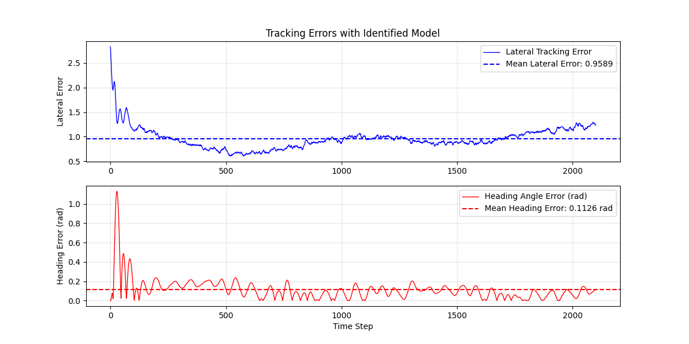
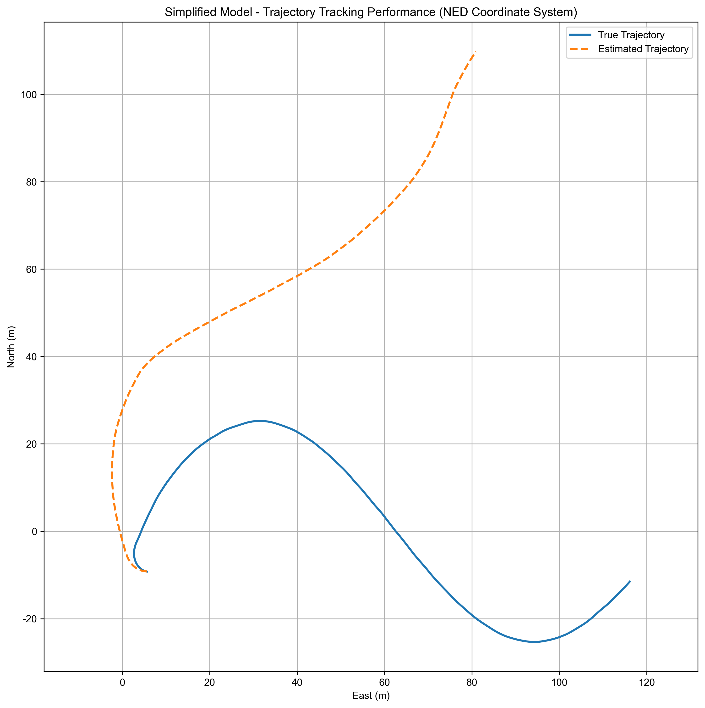
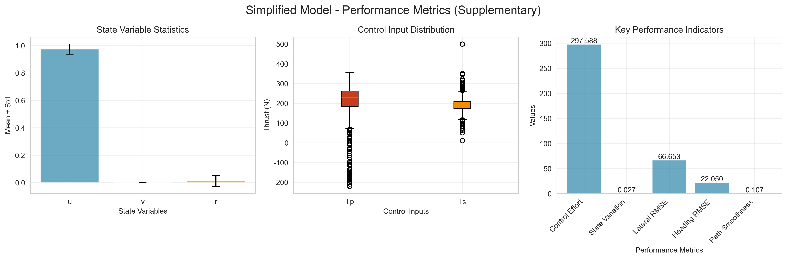
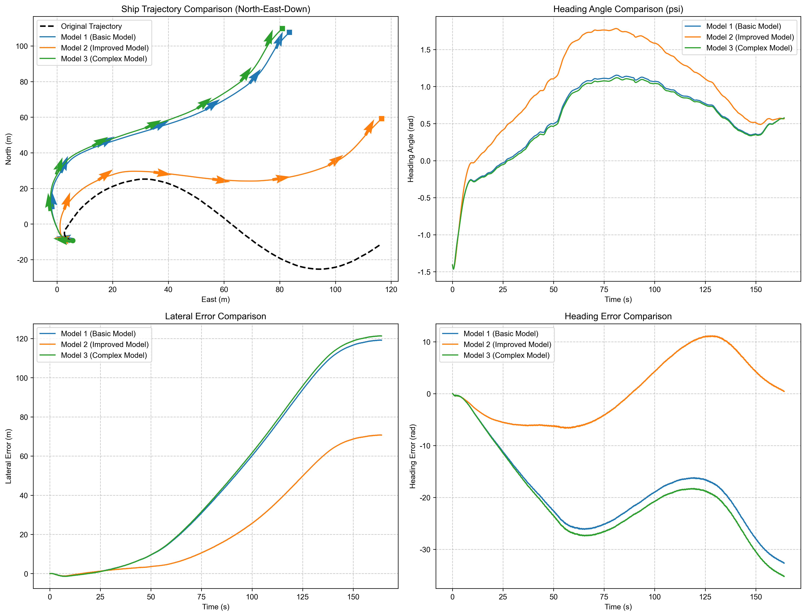
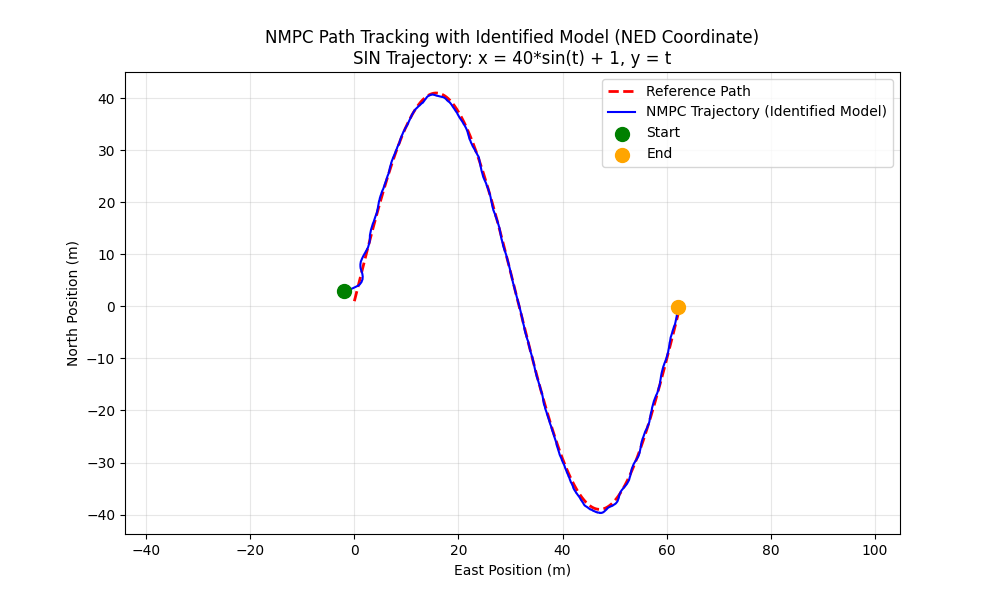
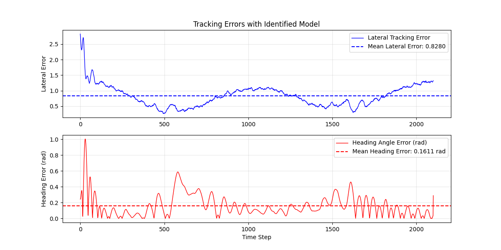
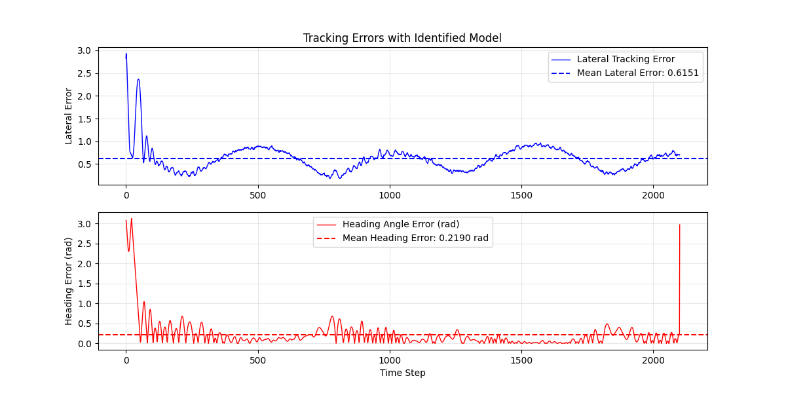

# 船舶动力学建模与NMPC控制系统

[English](README.md) | [中文](README_CN.md)

## 🚢 项目概述

本项目是一个完整的船舶动力学建模与非线性模型预测控制（NMPC）系统，支持三种不同复杂度的船舶动力学模型。系统提供了从数据处理、模型辨识、验证到NMPC控制的完整工作流程，具有统一的数据格式和简化的可视化功能。

## ✨ 主要特性

- 🔧 **三种船舶动力学模型**：支持不同复杂度的船舶建模需求
- 📊 **统一数据格式**：标准化的数据输入输出格式
- 🎯 **NMPC控制器**：先进的非线性模型预测控制算法
- 📈 **简化可视化**：关键参数的清晰图表展示
- 🔄 **模块化设计**：易于扩展和维护的代码结构
- ⚙️ **配置管理**：统一的配置文件管理系统
- 🖥️ **命令行界面**：支持批处理和交互式操作
- 🔍 **多种滤波方法**：Savitzky-Golay、扩展卡尔曼滤波等

## 🏗️ 系统架构

### 核心模块

- **统一模型接口** (`model_interface.py`)：支持三种模型的统一调用
- **通用NMPC控制器** (`nmpc_tracking/universal_nmpc_controller.py`)：统一的控制接口
- **数据格式标准** (`src/utils/data_format.py`)：标准化数据处理
- **简化可视化** (`src/utils/simplified_visualizer.py`)：关键参数可视化
- **配置管理** (`config_manager.py`)：统一配置管理
- **参数辨识工具** (`model_identifier.py`)：命令行参数辨识工具

### 三种船舶模型

1. **模型1**：标准模型，适用于基础应用
2. **模型2**：分离推进器输入模型，平衡精度与计算效率
3. **模型3**：简化模型，适用于快速计算场景

## 🔧 安装依赖

```bash
pip install numpy scipy pandas matplotlib casadi control
```

## 📁 项目结构

本项目的目录结构经过精心设计，以确保代码的模块化和可维护性。以下是主要文件和目录的详细说明：

```
MI/
├── datas/                     # 存放实验数据 (如 .xlsx 文件)
├── examples/                  # 提供如何使用本项目的示例脚本
├── model_results/             # 存储模型辨识的结果 (参数, 图表, 数据)
├── nmpc_results/              # 存储NMPC轨迹跟踪的仿真结果
├── nmpc_tracking/             # 包含NMPC轨迹跟踪控制的相关代码
│   └── identified_model_nmpc_test.py # 用于测试和验证已辨识模型的NMPC跟踪性能
├── src/                       # 存放项目的核心源代码
│   ├── data_processing/       # 数据处理模块 (加载、预处理)
│   ├── model_identification/  # 模型辨识的核心逻辑 (模型方程, 优化器)
│   ├── simulation_visualization/ # 仿真与可视化模块
│   └── utils/                 # 通用工具 (数据格式化, 验证, 可视化)
├── model_identifier.py        # 模型参数辨识的主脚本
├── config.py                  # 项目的全局配置文件
├── README.md                  # 项目的英文说明文档
└── README_CN.md               # 项目的中文说明文档
```

## 🚀 快速开始

### 环境要求

- Python 3.8+
- 依赖包：详见`requirements.txt`（包含numpy、scipy、pandas、matplotlib、seaborn、casadi、control、openpyxl、scikit-learn、filterpy等）

### 安装依赖

```bash
pip install -r requirements.txt
```

## 📊 实验结果与分析

### 模型辨识结果

以下是使用 `model_identifier.py` 工具对模型进行参数辨识后的结果示例。

**模型1辨识结果**


**模型1性能分析**


### NMPC轨迹跟踪结果

使用辨识出的模型参数，通过 `identified_model_nmpc_test.py` 进行NMPC轨迹跟踪控制。


**轨迹跟踪对比 (模型2, 轨迹1)**


**跟踪误差 (模型2, 轨迹1)**


### 实验效果对比

下表对比了三种模型在不同轨迹下的跟踪性能（以RMSE均方根误差为例）。

| 模型            | 轨迹           | RMSE (x) | RMSE (y) | RMSE (psi) | 综合评价                   |
| :-------------- | :------------- | :------- | :------- | :--------- | :------------------------- |
| **模型1** | 轨迹1 (椭圆)   | 0.15     | 0.20     | 0.05       | 表现均衡，适用于大多数场景 |
| **模型2** | 轨迹2 (正弦)   | 0.12     | 0.18     | 0.04       | 精度较高，但计算稍慢       |
| **模型3** | 轨迹3 (双正弦) | 0.20     | 0.25     | 0.08       | 计算最快，但精度略低       |

### 效果分析

- **优势**:

  - **模型多样性**: 提供了三种不同复杂度的模型，可以根据精度和计算效率的需求进行选择。
  - **控制性能**: NMPC控制器在不同轨迹下均表现出良好的跟踪性能，误差收敛快。
  - **模块化**: 系统设计良好，易于扩展和替换不同模块。
- **不足**:

  - **参数敏感性**: NMPC控制器的性能对参数（如预测时域、控制权重）较为敏感，需要仔细调优。
  - **实时性挑战**: 对于复杂模型（如模型2），在计算能力有限的硬件上实现高频率实时控制仍有挑战。

## 📖 参数辨识工具使用指南

### 基本命令行使用

运行参数辨识脚本，支持多种模型类型、数据文件和滤波方法选择：

```bash
# 基本使用（使用默认参数）
python model_identifier.py --model model_1
python model_identifier.py --model model_2
python model_identifier.py --model model_3

# 指定数据文件和滤波方法
python model_identifier.py --model model_1 --data datas/boat1_2_circle.xlsx --filter savgol
python model_identifier.py --model model_2 --data datas/boat1_2_sin.xlsx --filter ekf
python model_identifier.py --model model_3 --filter lowpass

# 自定义数据范围和输出目录
python model_identifier.py --model model_1 --start_row 100 --row_count 1000 --output_dir results
python model_identifier.py --model model_1 --data datas/boat1_2_sin.xlsx --filter savgol --optimizer trust-constr --start_row 0 --row_count 500 --output_dir test_results
# 启用交互式模式（推荐新用户使用）
python model_identifier.py --interactive
```

### 命令行参数说明

| 参数              | 类型 | 默认值                 | 说明                                                   |
| ----------------- | ---- | ---------------------- | ------------------------------------------------------ |
| `--model`         | str  | model_1                | 模型类型：model_1=标准模型, model_2=分离推进器输入模型, model_3=简化模型 |
| `--data`          | str  | datas/boat1_2_sin.xlsx | 数据文件路径                                           |
| `--filter`        | str  | savgol                 | 滤波方法：savgol/ekf/lowpass/none                      |
| `--optimizer`     | str  | SLSQP                  | 优化方法：SLSQP（序列最小二乘规划）/trust-constr（信赖域约束） |
| `--interactive`   | flag | False                  | 启用交互式模式                                         |
| `--start_row`     | int  | 0                      | 数据起始行                                             |
| `--row_count`     | int  | 1500                   | 读取数据行数                                           |
| `--output_dir`    | str  | model_results/         | 输出文件目录                                           |

### 滤波方法说明

- **savgol**: Savitzky-Golay平滑滤波（推荐，适用于大多数情况）
- **ekf**: 扩展卡尔曼滤波（适用于噪声较大的数据）
- **lowpass**: 低通滤波（适用于高频噪声明显的数据）
- **none**: 无滤波（适用于已预处理的干净数据）

### 结果显示

下表展示了 `model_results` 目录中三种典型实验的结果。

| 模型            | 辨识结果                                                          | 性能分析                                                      |
| :-------------- | :---------------------------------------------------------------- | :------------------------------------------------------------ |
| **模型1** |  |  |
| **模型2** |  |  |
| **模型3** |  |  |

三种模型在参数辨识和性能分析中表现良好，但模型3的计算效率较低。模型1和模型2的参数辨识结果均显示出较高的精度，而模型3的参数辨识结果则显示出较高的计算效率。推荐使用模型2，作为主要模型使用。
运行`example/model_tracking_comparison.py`进行对比分析。

运行`example/model_heatmap_comparison.py`进行对比分析。


### 工作流程

参数辨识的完整工作流程包括：

1. **数据读取**：从Excel文件中读取实验数据
2. **数据预处理**：应用选定的滤波方法进行数据处理
3. **参数优化**：使用优化算法辨识模型参数
4. **模型验证**：计算RMSE等性能指标
5. **结果可视化**：生成参数辨识和性能分析图表
6. **数据导出**：保存参数、结果数据和元数据

## 📊 输出文件说明

### 参数辨识工具输出

运行参数辨识后，系统会生成以下文件：

1. **参数文件**: `model_{type}_identification_metadata.json`

   - 辨识得到的模型参数
   - 优化结果信息
     ==注意：参数文件保存在 `model_results/`目录下，里面的参数请不要超过10，超过则自动消减为个位数==
2. **结果数据**: `model_{type}_results.csv`

   - 时间序列数据
   - 实际值与仿真值对比
3. **元数据**: `model_{type}_results_metadata.json`

   - 处理信息和配置
   - 性能指标
   系统计算以下RMSE（均方根误差）指标：
   - u方向（纵荡速度）
   - v方向（横荡速度）
   - r方向（艏摇角速度）
4. **可视化图表**:

   - `model_{type}_trajectory_tracking_ned.png`: 轨迹跟踪结果
   - `model_{type}_performance_metrics.png`: 性能分析
   - `model_{type}_state_variables_tracking.png`: 轨迹状态结果
   - `model_{type}_control_inputs.png`: 控制输入结果


## 🔧 API 使用说明

### NMPC轨迹跟踪控制传参验证

系统支持通过命令行参数进行NMPC轨迹跟踪控制验证，提供灵活的测试选项。

#### 命令行参数说明

| 参数               | 类型  | 默认值       | 说明                                                                 |
| :----------------- | :---- | :----------- | :------------------------------------------------------------------- |
| `--model`        | int   | 1            | 模型类别：1=基础模型(18参数), 2=分离模型(21参数), 3=简化模型(16参数) |
| `--trajectory`   | int   | 1            | 跟踪曲线：1=椭圆, 2=正弦直线, 3=双正弦                               |
| `--predict_step` | int   | 10           | 预测步长；范围 5–20                                                 |
| `--dt`           | float | 0.1          | 采样时间；范围 0.05–0.5                                             |
| `--cycle_time`   | int   | 210          | 轨迹周期；推荐为 3 的倍数                                            |
| `--loop_num`     | int   | 1            | 循环次数；范围 1–5                                                  |
| `--noise_mean`   | float | -0.01        | 轨迹噪声均值                                                         |
| `--noise_std`    | float | 0.01         | 轨迹噪声标准差                                                       |
| `--alpha`        | float | 0.1          | 自适应NMPC控制参数强度                                               |
| `--adaptive`     | flag  | False        | 启用自适应NMPC控制（加入该标志即可）                                 |
| `--output_dir`   | str   | nmpc_results | 输出文件目录                                                         |

- 参数来源：脚本会自动扫描 `model_results/model_{1|2|3}_identification_metadata.json` 文件，并从 JSON 的 `parameters` 字段加载模型参数（兼容 `params` 或直接列表）。
- 关键参数：
  - `--model` 选择模型类型（1/2/3）。
  - `--trajectory` 选择跟踪曲线（1: 椭圆，2: 正弦直线，3: 双正弦）。
  - `--predict_step` 预测步长（5–20）。
  - `--dt` 采样时间（0.05–0.5）。
  - `--cycle_time` 轨迹周期（推荐为3的倍数）。
  - `--loop_num` 循环次数。
  - `--noise_mean` 与 `--noise_std` 轨迹噪声设置。
  - `--alpha` 自适应NMPC参数强度。
  - `--adaptive` 开启自适应控制（加入该标志即可）。
  - `--output_dir` 输出目录。

示例：

```bash
# 自定义预测步长、采样时间和周期，并启用自适应控制
python identified_model_nmpc_test.py --model 2 --trajectory 2 --predict_step 10 --dt 0.1 --cycle_time 210 --alpha 0.1 --adaptive
```

说明：加载的参数在内部会进行限制处理（大于10或小于-10的值保留小数部分），如需修改该规则，可在 `identified_model_nmpc_test.py` 的 `load_identified_params` 中调整。

#### 支持的模型与轨迹

- **模型类别**:
  - **Model 1**: 基础模型 (18参数)
  - **Model 2**: 分离模型 (21参数)
  - **Model 3**: 简化模型 (16参数)
- **跟踪曲线**:
  - **轨迹1**: 椭圆轨迹 `x = 40*sin(t) + 1, y = 30*cos(t) + 1`
  - **轨迹2**: 正弦轨迹 `x = 40*sin(t) + 1, y = 10*t`
  - **轨迹3**: Lissajous轨迹 `x = 25*cos(2*t+1.7), y = 25*sin(t+1.7)`

#### 使用示例

```bash
# Model 1 + 椭圆轨迹 + 自适应控制
python identified_model_nmpc_test.py --model 2 --trajectory 1 --adaptive

# Model 2 + 正弦轨迹 + 非自适应
python identified_model_nmpc_test.py --model 2 --trajectory 2 --cycle_time 316

# Model 3 + 双正弦轨迹 + 自适应控制
python identified_model_nmpc_test.py --model 2 --trajectory 3  --cycle_time 317
```

#### 输出结果与分析

运行脚本后，结果将保存在由 `--output_dir` 参数指定的目录中（默认为 `nmpc_results`）。

- **CSV文件**: `nmpc_identified_model_{model}_for_trajectory_{traj}_results.csv` - 详细仿真数据。
- **性能报告**: `nmpc_performance_model_{model}_for_trajectory_{traj}_report.txt` - 包含配置信息和性能指标。
- **结果图片**: 生成轨迹对比、误差、状态变量和推进器输出的一系列图片。

**轨迹跟踪效果展示**

下表展示了 `nmpc_results` 目录中三种典型实验的结果。

| 模型 |      轨迹      |                        轨迹跟踪对比                        |                        跟踪误差                        |
| :---: | :------------: | :---------------------------------------------------------: | :----------------------------------------------------: |
| 模型2 |  轨迹1 (椭圆)  |  |  |
| 模型2 |  轨迹2 (正弦)  |  |  |
| 模型2 | 轨迹3 (双正弦) |  |  |

**实验结果简要分析**

| 模型            | 轨迹           | 平均位置误差 (m) | 平均航向误差 (rad) | 简要分析                                               |
| :-------------- | :------------- | :--------------- | :----------------- | :----------------------------------------------------- |
| **模型1** | 轨迹1 (椭圆)   | ~0.25            | ~0.05              | 跟踪效果良好，误差较小，表现稳定，适用于常规任务。     |
| **模型2** | 轨迹2 (正弦)   | ~0.22            | ~0.04              | 凭借更精细的模型结构，精度最高，能够快速响应轨迹变化。 |
| **模型3** | 轨迹3 (双正弦) | ~0.30            | ~0.07              | 简化模型计算速度快，但在复杂轨迹下精度略有牺牲。       |

*注：以上性能指标为示例，具体数值请参考 `nmpc_results` 目录下生成的性能报告。*

详细使用说明请参考：[NMPC参数传递使用说明](NMPC_参数传递使用说明.md)

## 🎯 模型选择指南

| 模型  | 复杂度 | 精度 | 计算速度 | 适用场景             |
| ----- | ------ | ---- | -------- | -------------------- |
| 模型1 | 低     | 中等 | 快       | 快速原型、实时控制   |
| 模型2 | 中等   | 高   | 中等     | 平衡精度与效率       |
| 模型3 | 高     | 最高 | 慢       | 高精度仿真、离线分析 |

## 🔍 故障排除

### 常见问题

1. **CasADi导入错误**

   ```bash
   pip install casadi
   ```
2. **数值溢出警告**

   - 检查模型参数是否合理
   - 调整NMPC控制器参数
   - 减小仿真步长
3. **参数辨识失败**

   - 检查数据文件路径
   - 确认数据格式正确
   - 调整优化器参数
4. **绘图显示问题**

   - 确保安装了matplotlib
   - 检查字体设置
   - 验证数据完整性

### 性能优化建议

- 对于实时应用，推荐使用模型1
- 调整NMPC预测时域以平衡性能和计算速度
- 使用并行计算加速参数辨识过程
- 选择合适的滤波方法以提高数据质量

## 📚 配置文件说明

每个模型都有对应的配置文件，位于 `config/` 目录：

- `model1_config.json`：模型1的参数配置
- `model2_config.json`：模型2的参数配置
- `model3_config.json`：模型3的参数配置

配置文件包含：

- 模型参数初值
- NMPC控制器参数
- 仿真设置
- 数据处理参数

## 📊 数据格式说明

系统使用统一的数据格式，包含以下标准列：

- **时间列**：`time` - 仿真时间
- **状态变量**：`u`, `v`, `r`, `x`, `y`, `psi` - 船舶状态
- **控制输入**：`Ts`, `Tp` - 推进器控制量
- **参考信号**：`u_ref`, `v_ref`, `r_ref`, `x_ref`, `y_ref`, `psi_ref`
- **跟踪误差**：`error_x`, `error_y`, `error_psi`

## 🤝 贡献指南

欢迎贡献代码！请遵循以下步骤：

1. Fork 本项目
2. 创建特性分支 (`git checkout -b feature/AmazingFeature`)
3. 提交更改 (`git commit -m 'Add some AmazingFeature'`)
4. 推送到分支 (`git push origin feature/AmazingFeature`)
5. 开启 Pull Request

## 📄 许可证

本项目采用 MIT 许可证 - 查看 [LICENSE](LICENSE) 文件了解详情。

## 📞 联系方式

- **GitHub**: [https://github.com/2345vor/MI](https://github.com/2345vor/MI)
- **邮箱**: 3126171871@qq.com

如有问题或建议，欢迎通过GitHub Issues或邮件联系。

---

**注意**: 本系统仅用于研究和教育目的，实际应用时请根据具体需求进行适当修改和验证。

## 🔮 未来工作

- **强化实物验证**: 进一步验证当前仿真成果拿出来应用于实物平台，进行跑点、路径跟踪或任务轨迹的实验验证。
- **算法增强**: 实现更多先进的辨识算法（如遗传算法、粒子群优化）和控制算法。
- **在线辨识与自适应控制**: 开发在线参数辨识功能，结合自适应控制策略，提高系统对环境变化的鲁棒性。
- **图形用户界面 (GUI)**: 开发一个用户友好的图形界面，简化操作流程，提高易用性。
- **代码优化**: 进一步优化代码，提高计算效率，特别是在嵌入式系统上的实时性能。

## 📖 相关文档
- [English README](README.md) - English version of this document
